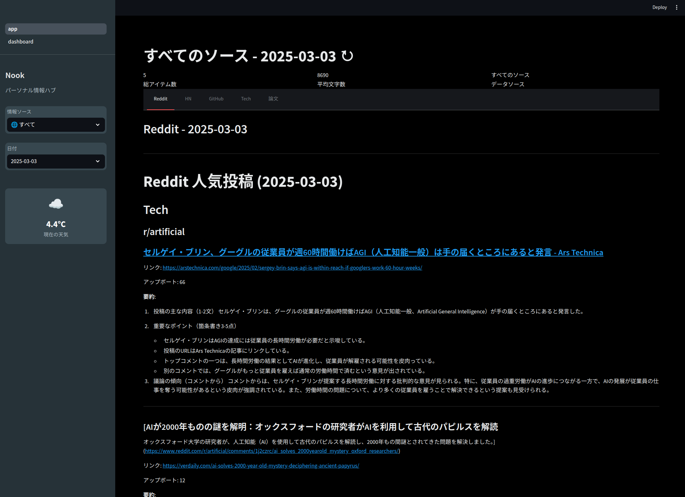

# Nook - パーソナル情報ハブ

Nookは、さまざまな情報ソース（Reddit、Hacker News、GitHub Trending、Tech Feed、arXiv論文）からコンテンツを収集し、
一元的に表示するパーソナル情報ハブです。

Discus0434氏の[Nook](https://github.com/discus0434/nook)をベースに、
以下の変更を行っています。
- 完全にローカルで動作するように変更(AWS/S3は使用していません)
- 取得した記事をローカルストレージの~/nook/data/に保存
- 生成AIのAPIを変更(GeminiからGrok3 APIに変更)
- 天気APIを追加(OpenWeatherMap API)
- フロントエンドを追加(Streamlit)
- バックエンドを追加(FastAPI)
- サービスを追加(GitHub Trending、Hacker News、Tech Feed、arXiv論文)
- 取得した記事をすべて日本語に変換

*注意事項*
- チャット機能は実装されていません。

## 画面イメージ


## 機能

- 複数の情報ソースからのコンテンツ収集と表示
  - Reddit人気投稿
  - Hacker News記事
  - GitHub Trendingリポジトリ
  - 技術ブログのRSSフィード
  - arXiv論文
- 日付ごとのコンテンツフィルタリング
- 天気情報の表示
- コンテンツに関するチャット機能

## アーキテクチャ

Nookは以下のコンポーネントで構成されています：

1. **バックエンド（FastAPI）**
   - コンテンツAPI
   - 天気API
   - チャットAPI

2. **フロントエンド（Streamlit）**
   - サイドバー（ソース選択、日付選択、天気表示）
   - コンテンツビューア
   - チャットインターフェース

3. **サービス**
   - Reddit Explorer：Redditの人気投稿を収集・要約
   - Hacker News Retriever：Hacker Newsの記事を収集
   - GitHub Trending：GitHubのトレンドリポジトリを収集
   - Tech Feed：技術ブログのRSSフィードを監視・収集・要約
   - Paper Summarizer：arXiv論文を収集・要約
   - ローカルストレージ：収集したデータの保存
   - Grok3 APIクライアント：テキスト生成・要約

## セットアップ

### 前提条件

- Python 3.10以上
- 以下のAPIキー：
  - OpenWeatherMap APIキー（天気機能用）
  - Grok3 APIキー（チャット・要約機能用）
  - Reddit API認証情報（Reddit Explorer用）

### インストール

```bash
# リポジトリのクローン
git clone https://github.com/Tomatio13/nook.git
cd nook

# 依存関係のインストール
python -m venv venv
source venv/bin/activate
pip install -r requirements.txt

# 環境変数の設定
cp .env.example .env

# .envファイルの環境変数を設定
export OPENWEATHERMAP_API_KEY=your_api_key
export GROK_API_KEY=your_api_key
export REDDIT_CLIENT_ID=your_client_id
export REDDIT_CLIENT_SECRET=your_client_secret
export REDDIT_USER_AGENT=your_user_agent
```

### 実行

```bash
# バックエンドの起動
python -m nook.api.run

# または直接uvicornを使用
uvicorn nook.api.main:app --reload

# フロントエンドの起動（別ターミナルで）
python -m streamlit run nook/frontend/app.py
```

## 情報の取得手順

各情報ソースからデータを収集するには、以下のコマンドを使用します：

```bash
# すべてのサービスを実行
python -m nook.services.run_services --service all

# 特定のサービスのみ実行
python -m nook.services.run_services --service reddit
python -m nook.services.run_services --service hackernews
python -m nook.services.run_services --service github
python -m nook.services.run_services --service techfeed
python -m nook.services.run_services --service paper
```

### データの保存場所

収集されたデータは `data/` ディレクトリに保存されます：

```
data/
├── github_trending/     # GitHub Trendingデータ
├── hacker_news/         # Hacker Newsデータ
├── paper_summarizer/    # arXiv論文データ
├── reddit_explorer/     # Redditデータ
└── tech_feed/           # 技術ブログフィードデータ
```

各サービスは日付ごとにファイルを作成します（例：`2023-04-15.md`）。

## 開発

### プロジェクト構造

```
nook/
├── api/                  # FastAPI バックエンド
│   ├── models/           # データモデル
│   └── routers/          # APIルーター
├── common/               # 共通ユーティリティ
│   ├── storage.py        # ローカルストレージ
│   └── grok_client.py    # Grok3 APIクライアント
├── frontend/             # Streamlit フロントエンド
│   ├── components/       # UIコンポーネント
│   └── utils/            # ユーティリティ
└── services/             # サービス
    ├── github_trending/  # GitHub Trendingサービス
    ├── hacker_news/      # Hacker Newsサービス
    ├── paper_summarizer/ # 論文要約サービス
    ├── reddit_explorer/  # Redditエクスプローラー
    └── tech_feed/        # 技術フィードサービス
```

## ライセンス

GNU AFFERO GENERAL PUBLIC LICENSE

## 謝辞
- [Nook](https://github.com/discus0434/nook)
- [FastAPI](https://fastapi.tiangolo.com/)
- [Streamlit](https://streamlit.io/)
- [OpenWeatherMap](https://openweathermap.org/)
- [Grok](https://grok.ai/)
- [Reddit API](https://www.reddit.com/dev/api/)
- [Hacker News API](https://github.com/HackerNews/API)
- [GitHub](https://github.com/)
- [arXiv](https://arxiv.org/)
