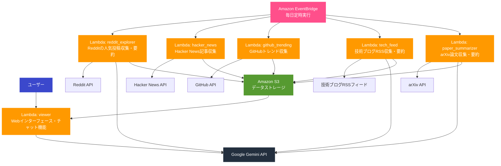
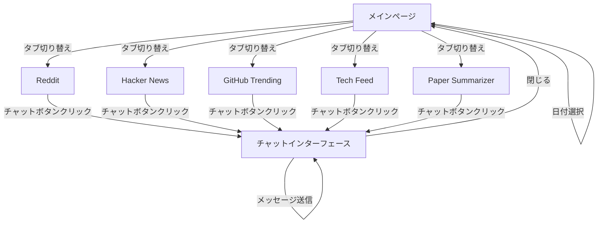

# Nook 詳細設計書

## システムアーキテクチャ

### クライアントサーバーモデルの詳細
Nookはサーバーレスアーキテクチャを採用しており、AWS Lambdaを中心に構成されています。クライアント（ブラウザ）からのリクエストはLambda関数（viewer）によって処理され、S3に保存されたデータを取得して表示します。

### フロントエンド（Webアプリ）の構成
- **技術スタック**: HTML, CSS, JavaScript, Bootstrap 5.3.0
- **レスポンシブデザイン**: モバイルデバイスとデスクトップの両方に対応
- **主要コンポーネント**:
  - ナビゲーションバー
  - タブ切り替え機能
  - Markdownレンダリング
  - チャットインターフェース

### バックエンドサーバーの構成
- **AWS Lambda**: 各機能ごとに独立したLambda関数
- **Amazon S3**: データストレージ
- **Amazon EventBridge**: 定期実行のスケジューリング
- **API**: Google Gemini API, Reddit API, 各種Web APIとの連携

### マイクロサービスアーキテクチャ
Nookは以下の独立したマイクロサービスで構成されています：
1. **reddit_explorer**: Redditの人気投稿を収集・要約
2. **hacker_news**: Hacker Newsの記事を収集
3. **github_trending**: GitHubのトレンドリポジトリを収集
4. **tech_feed**: 技術ブログのRSSフィードを監視・収集・要約
5. **paper_summarizer**: arXiv論文を収集・要約
6. **viewer**: Webインターフェースとチャット機能を提供

### アーキテクチャ図



## データベース設計

Nookはデータベースを使用せず、Amazon S3をデータストレージとして利用しています。各Lambda関数が収集したデータはMarkdown形式でS3に保存され、日付ごとに整理されています。

### 主要エンティティのリスト
- **RedditPost**: Redditの投稿情報
- **Story**: Hacker Newsの記事情報
- **Repository**: GitHubのリポジトリ情報
- **Article**: 技術ブログの記事情報
- **PaperInfo**: arXiv論文の情報

### 各エンティティの属性と関係性

#### RedditPost
- **type**: 投稿タイプ（image, video, text, link等）
- **id**: 投稿ID
- **title**: タイトル
- **url**: URL
- **upvotes**: アップボート数
- **text**: 本文
- **permalink**: 投稿へのパーマリンク
- **comments**: コメントリスト
- **summary**: 要約内容

#### Story (Hacker News)
- **title**: タイトル
- **score**: スコア
- **url**: URL（オプション）
- **text**: 本文（オプション）

#### Repository (GitHub)
- **name**: リポジトリ名
- **description**: 説明
- **link**: リポジトリへのリンク
- **stars**: スター数

#### Article (Tech Feed)
- **feed_name**: フィード名
- **title**: タイトル
- **url**: URL
- **text**: 本文
- **soup**: BeautifulSoupオブジェクト
- **category**: カテゴリ（オプション）
- **summary**: 要約内容

#### PaperInfo (arXiv)
- **title**: 論文タイトル
- **abstract**: 要約
- **url**: URL
- **contents**: 論文の内容
- **summary**: 要約内容

### S3ストレージ構造
```
s3://[bucket-name]/
├── reddit_explorer/
│   ├── YYYY-MM-DD.md
│   └── ...
├── hacker_news/
│   ├── YYYY-MM-DD.md
│   └── ...
├── github_trending/
│   ├── YYYY-MM-DD.md
│   └── ...
├── tech_feed/
│   ├── YYYY-MM-DD.md
│   └── ...
├── paper_summarizer/
│   ├── YYYY-MM-DD.md
│   ├── arxiv_ids-YYYY-MM-DD.txt
│   └── ...
```

## APIエンドポイント

### Viewer Lambda API
- **GET /**: メインページを表示
  - クエリパラメータ: `date` (オプション) - 表示する日付（YYYY-MM-DD形式）
  - レスポンス: HTML

- **GET /api/weather**: 天気データを取得
  - レスポンス: JSON（気温と天気アイコン情報）

- **POST /chat/{topic_id}**: チャット機能
  - パスパラメータ: `topic_id` - トピックID
  - リクエストボディ:
    - `message`: ユーザーメッセージ
    - `markdown`: 関連するMarkdown内容
    - `chat_history`: チャット履歴（オプション）
  - レスポンス: JSON（AIの応答）

## データモデル

### RedditExplorer
```python
@dataclass
class RedditPost:
    type: Literal["image", "gallery", "video", "poll", "crosspost", "text", "link"]
    id: str
    title: str
    url: str | None
    upvotes: int
    text: str
    permalink: str = ""
    comments: list[dict[str, str | int]] = field(init=False)
    summary: str = field(init=False)
    thumbnail: str = "self"
```

### HackerNews
```python
@dataclass
class Story:
    title: str
    score: int
    url: str | None = None
    text: str | None = None
```

### GitHubTrending
```python
@dataclass
class Repository:
    name: str
    description: str | None
    link: str
    stars: int
```

### TechFeed
```python
@dataclass
class Article:
    feed_name: str
    title: str
    url: str
    text: str
    soup: BeautifulSoup
    category: str | None = field(default=None)
    summary: list[str] = field(init=False)
```

### PaperSummarizer
```python
@dataclass
class PaperInfo:
    title: str
    abstract: str
    url: str
    contents: str
    summary: str = field(init=False)
```

## ファイル・フォルダ構成

```
.
├── LICENSE - ライセンスファイル（GNU Affero General Public License v3.0）
├── Makefile - ビルドとデプロイのためのMakeファイル
├── README.md - プロジェクトの説明書
├── app.py - CDKアプリケーションのエントリーポイント
├── assets/ - ロゴや画像などの静的アセット
│   ├── logos/ - ロゴファイル
│   │   ├── nook-logo-01.svg
│   │   ├── nook-logo-02.svg
│   │   ├── nook-logo-03.svg
│   │   └── nook-logo-04.svg
│   └── screenshots/ - スクリーンショット
│       ├── chat-screenshot.webp
│       ├── mobile-screenshot.webp
│       ├── nook-demo.gif
│       └── web-screenshot.webp
├── cdk.json - CDK設定ファイル
├── nook/ - メインソースコード
│   ├── __init__.py
│   ├── lambda/ - Lambda関数のソースコード
│   │   ├── common/ - 共通ユーティリティ
│   │   │   ├── python/
│   │   │   │   └── gemini_client.py - Gemini APIクライアント
│   │   │   └── requirements.txt
│   │   ├── github_trending/ - GitHubトレンド収集機能
│   │   │   ├── github_trending.py - メイン実装
│   │   │   ├── languages.toml - 言語設定
│   │   │   └── requirements.txt
│   │   ├── hacker_news/ - Hacker News収集機能
│   │   │   ├── hacker_news.py - メイン実装
│   │   │   └── requirements.txt
│   │   ├── paper_summarizer/ - 論文要約機能
│   │   │   ├── paper_summarizer.py - メイン実装
│   │   │   └── requirements.txt
│   │   ├── reddit_explorer/ - Reddit収集機能
│   │   │   ├── reddit_explorer.py - メイン実装
│   │   │   ├── requirements.txt
│   │   │   └── subreddits.toml - サブレディット設定
│   │   ├── tech_feed/ - 技術ブログ収集機能
│   │   │   ├── Dockerfile - Dockerコンテナ定義
│   │   │   ├── feed.toml - フィード設定
│   │   │   ├── requirements.txt
│   │   │   └── tech_feed.py - メイン実装
│   │   └── viewer/ - Webインターフェース
│   │       ├── requirements.txt
│   │       ├── templates/ - HTMLテンプレート
│   │       │   └── index.html - メインページテンプレート
│   │       └── viewer.py - メイン実装
│   └── nook_stack.py - CDKスタック定義
├── package.json - npmパッケージ設定
├── pyproject.toml - Pythonプロジェクト設定
├── requirements-dev.txt - 開発用依存関係
└── requirements.txt - 本番用依存関係
```

## コンポーネント

### 1. GeminiClient
- **役割**: Google Gemini APIとの通信を担当
- **入力**: テキストプロンプト、システム指示
- **出力**: 生成されたテキスト、チャット応答
- **主要機能**:
  - `generate_content()`: テキスト生成
  - `create_chat()`: チャットセッション作成
  - `send_message()`: メッセージ送信
  - `chat_with_search()`: 検索機能付きチャット

### 2. RedditExplorer
- **役割**: Redditの人気投稿を収集・要約
- **入力**: 設定ファイルからのサブレディットリスト
- **出力**: 要約されたMarkdownファイル（S3に保存）
- **主要機能**:
  - `_retrieve_hot_posts()`: 人気投稿の取得
  - `_retrieve_top_comments_of_post()`: トップコメントの取得
  - `_summarize_reddit_post()`: 投稿の要約
  - `_store_summaries()`: 要約の保存

### 3. HackerNewsRetriever
- **役割**: Hacker Newsの記事を収集
- **入力**: Hacker News API
- **出力**: 記事情報のMarkdownファイル（S3に保存）
- **主要機能**:
  - `_get_top_stories()`: トップ記事の取得
  - `_summarize_story()`: 記事の要約
  - `_store_summaries()`: 要約の保存

### 4. GithubTrending
- **役割**: GitHubのトレンドリポジトリを収集
- **入力**: 設定ファイルからの言語リスト
- **出力**: リポジトリ情報のMarkdownファイル（S3に保存）
- **主要機能**:
  - `_retrieve_repositories()`: リポジトリ情報の取得
  - `_store_summaries()`: 情報の保存

### 5. PaperSummarizer
- **役割**: arXiv論文を収集・要約
- **入力**: Hugging Faceでキュレーションされた論文ID
- **出力**: 要約されたMarkdownファイル（S3に保存）
- **主要機能**:
  - `_retrieve_paper_info()`: 論文情報の取得
  - `_extract_body_text()`: 論文本文の抽出
  - `_summarize_paper_info()`: 論文の要約
  - `_store_summaries()`: 要約の保存

### 6. TechFeed
- **役割**: 技術ブログのRSSフィードを監視・収集・要約
- **入力**: 設定ファイルからのフィードURL
- **出力**: 要約されたMarkdownファイル（S3に保存）
- **主要機能**:
  - `_filter_entries()`: 新しいエントリのフィルタリング
  - `_retrieve_article()`: 記事の取得
  - `_summarize_article()`: 記事の要約
  - `_store_summaries()`: 要約の保存

### 7. Viewer
- **役割**: Webインターフェースとチャット機能を提供
- **入力**: ユーザーリクエスト、S3からのデータ
- **出力**: HTMLページ、チャット応答
- **主要機能**:
  - `index()`: メインページの表示
  - `chat()`: チャット機能
  - `fetch_markdown()`: S3からのMarkdown取得
  - `get_weather_data()`: 天気データの取得

## データの流れ

### 1. 情報収集フロー
1. **EventBridge**が毎日定時に各Lambda関数をトリガー
2. 各Lambda関数が外部APIから情報を取得
   - RedditExplorer: Reddit APIからの投稿取得
   - HackerNewsRetriever: Hacker News APIからの記事取得
   - GithubTrending: GitHubからのトレンドリポジトリ取得
   - TechFeed: RSSフィードからの記事取得
   - PaperSummarizer: arXiv APIからの論文取得
3. 必要に応じてGemini APIを使用してコンテンツを要約
4. 処理結果をMarkdown形式でS3に保存

### 2. 表示フロー
1. ユーザーがブラウザからViewerにアクセス
2. Viewerが日付に基づいてS3から各種データを取得
3. 取得したMarkdownをHTMLに変換して表示
4. 必要に応じて天気データを取得して表示

### 3. チャットフロー
1. ユーザーがチャットインターフェースでメッセージを送信
2. Viewerがメッセージと関連するMarkdownをGemini APIに送信
3. 必要に応じてリンク先の内容を取得して追加コンテキストとして提供
4. Gemini APIからの応答をユーザーに表示

## ユーザーインターフェース

### 画面遷移図



## 開発環境

### 使用するOSSのバージョン
- Python 3.11
- AWS CDK
- Docker

### 必要なライブラリとそのバージョン
- **共通**:
  - google-generativeai: Gemini APIクライアント
  - tenacity: リトライ処理
  - boto3: AWS SDK

- **reddit_explorer**:
  - praw: Reddit API

- **hacker_news**:
  - requests: HTTP通信
  - beautifulsoup4: HTMLパース

- **github_trending**:
  - requests: HTTP通信
  - beautifulsoup4: HTMLパース

- **paper_summarizer**:
  - arxiv: arXiv API
  - requests: HTTP通信
  - beautifulsoup4: HTMLパース
  - tqdm: プログレスバー

- **tech_feed**:
  - feedparser: RSSパース
  - requests: HTTP通信
  - beautifulsoup4: HTMLパース

- **viewer**:
  - fastapi: Webフレームワーク
  - jinja2: テンプレートエンジン
  - mangum: AWS Lambda用アダプタ
  - uvicorn: ASGIサーバー

## 実行方法

### 環境変数の設定
```
GEMINI_API_KEY=your_gemini_api_key
REDDIT_CLIENT_ID=your_reddit_client_id
REDDIT_CLIENT_SECRET=your_reddit_client_secret
REDDIT_USER_AGENT=your_reddit_user_agent
```

### デプロイ方法
1. 依存関係のインストール
```bash
python -m venv .venv
source .venv/bin/activate  # Windowsの場合: .venv\Scripts\activate
pip install -r requirements.txt
pip install -r requirements-dev.txt
```

2. AWS CDKを使ったデプロイ
```bash
make cdk-deploy
```

### ローカル実行方法（開発用）
Viewerのみローカルで実行可能:
```bash
cd nook/lambda/viewer
python viewer.py
```
ブラウザで http://localhost:8080 にアクセス 