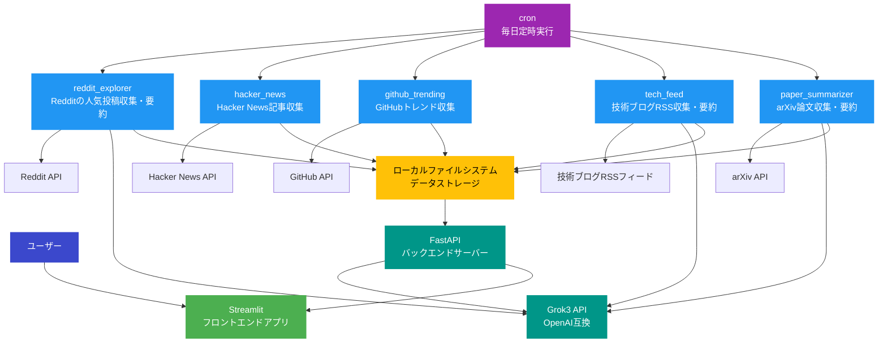
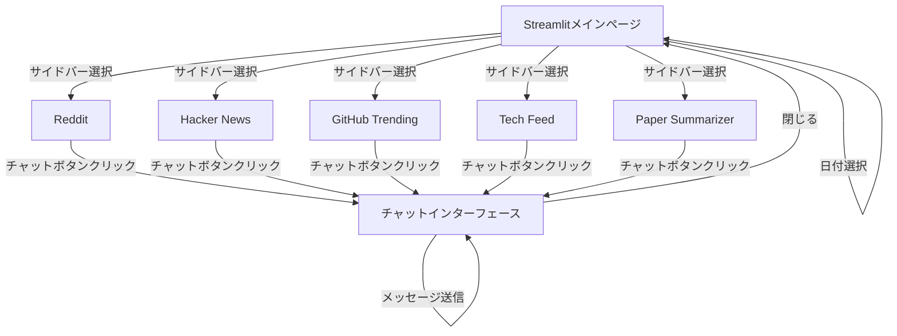

# Nook 詳細設計書

## システムアーキテクチャ

### クライアントサーバーモデルの詳細
Nookはローカル環境で動作するアーキテクチャを採用しています。バックエンドはFastAPIで構築され、フロントエンドはStreamlitを使用しています。データはローカルファイルシステムに保存され、定期的なデータ収集はcronジョブによって実行されます。

### フロントエンド（Streamlitアプリ）の構成
- **技術スタック**: Python, Streamlit
- **レスポンシブデザイン**: モバイルデバイスとデスクトップの両方に対応
- **主要コンポーネント**:
  - サイドバーナビゲーション
  - タブ切り替え機能
  - Markdownレンダリング
  - チャットインターフェース

### バックエンドサーバーの構成
- **FastAPI**: RESTful APIを提供
- **ローカルファイルシステム**: データストレージ
- **cron**: 定期実行のスケジューリング
- **API**: Grok3 API (OpenAI互換), Reddit API, 各種Web APIとの連携

### マイクロサービスアーキテクチャ
Nookは以下の独立したマイクロサービスで構成されています：
1. **reddit_explorer**: Redditの人気投稿を収集・要約
2. **hacker_news**: Hacker Newsの記事を収集
3. **github_trending**: GitHubのトレンドリポジトリを収集
4. **tech_feed**: 技術ブログのRSSフィードを監視・収集・要約
5. **paper_summarizer**: arXiv論文を収集・要約
6. **api_server**: FastAPIベースのバックエンドサーバー
7. **streamlit_app**: Streamlitベースのフロントエンドアプリケーション

### アーキテクチャ図



## データストレージ設計

Nookはローカルファイルシステムをデータストレージとして利用しています。各サービスが収集したデータはMarkdown形式で保存され、日付ごとに整理されています。

### 主要エンティティのリスト
- **RedditPost**: Redditの投稿情報
- **Story**: Hacker Newsの記事情報
- **Repository**: GitHubのリポジトリ情報
- **Article**: 技術ブログの記事情報
- **PaperInfo**: arXiv論文の情報

### 各エンティティの属性と関係性

#### RedditPost
- **type**: 投稿タイプ（image, video, text, link等）
- **id**: 投稿ID
- **title**: タイトル
- **url**: URL
- **upvotes**: アップボート数
- **text**: 本文
- **permalink**: 投稿へのパーマリンク
- **comments**: コメントリスト
- **summary**: 要約内容

#### Story (Hacker News)
- **title**: タイトル
- **score**: スコア
- **url**: URL（オプション）
- **text**: 本文（オプション）

#### Repository (GitHub)
- **name**: リポジトリ名
- **description**: 説明
- **link**: リポジトリへのリンク
- **stars**: スター数

#### Article (Tech Feed)
- **feed_name**: フィード名
- **title**: タイトル
- **url**: URL
- **text**: 本文
- **soup**: BeautifulSoupオブジェクト
- **category**: カテゴリ（オプション）
- **summary**: 要約内容

#### PaperInfo (arXiv)
- **title**: 論文タイトル
- **abstract**: 要約
- **url**: URL
- **contents**: 論文の内容
- **summary**: 要約内容

### ローカルストレージ構造
```
/data/
├── reddit_explorer/
│   ├── YYYY-MM-DD.md
│   └── ...
├── hacker_news/
│   ├── YYYY-MM-DD.md
│   └── ...
├── github_trending/
│   ├── YYYY-MM-DD.md
│   └── ...
├── tech_feed/
│   ├── YYYY-MM-DD.md
│   └── ...
├── paper_summarizer/
│   ├── YYYY-MM-DD.md
│   ├── arxiv_ids-YYYY-MM-DD.txt
│   └── ...
```

## APIエンドポイント

### FastAPI エンドポイント
- **GET /api/content/{source}**: 特定のソースのコンテンツを取得
  - パスパラメータ: `source` - データソース（reddit, hackernews, github, techfeed, paper）
  - クエリパラメータ: `date` (オプション) - 表示する日付（YYYY-MM-DD形式）
  - レスポンス: JSON

- **GET /api/weather**: 天気データを取得
  - レスポンス: JSON（気温と天気アイコン情報）

- **POST /api/chat/{topic_id}**: チャット機能
  - パスパラメータ: `topic_id` - トピックID
  - リクエストボディ:
    - `message`: ユーザーメッセージ
    - `markdown`: 関連するMarkdown内容
    - `chat_history`: チャット履歴（オプション）
  - レスポンス: JSON（AIの応答）

## データモデル

### RedditExplorer
```python
@dataclass
class RedditPost:
    type: Literal["image", "gallery", "video", "poll", "crosspost", "text", "link"]
    id: str
    title: str
    url: str | None
    upvotes: int
    text: str
    permalink: str = ""
    comments: list[dict[str, str | int]] = field(init=False)
    summary: str = field(init=False)
    thumbnail: str = "self"
```

### HackerNews
```python
@dataclass
class Story:
    title: str
    score: int
    url: str | None = None
    text: str | None = None
```

### GitHubTrending
```python
@dataclass
class Repository:
    name: str
    description: str | None
    link: str
    stars: int
```

### TechFeed
```python
@dataclass
class Article:
    feed_name: str
    title: str
    url: str
    text: str
    soup: BeautifulSoup
    category: str | None = field(default=None)
    summary: list[str] = field(init=False)
```

### PaperSummarizer
```python
@dataclass
class PaperInfo:
    title: str
    abstract: str
    url: str
    contents: str
    summary: str = field(init=False)
```

## ファイル・フォルダ構成

```
.
├── LICENSE - ライセンスファイル（GNU Affero General Public License v3.0）
├── Makefile - ビルドと実行のためのMakeファイル
├── README.md - プロジェクトの説明書
├── assets/ - ロゴや画像などの静的アセット
│   ├── logos/ - ロゴファイル
│   │   ├── nook-logo-01.svg
│   │   ├── nook-logo-02.svg
│   │   ├── nook-logo-03.svg
│   │   └── nook-logo-04.svg
│   └── screenshots/ - スクリーンショット
│       ├── chat-screenshot.webp
│       ├── mobile-screenshot.webp
│       ├── nook-demo.gif
│       └── web-screenshot.webp
├── data/ - データストレージディレクトリ
│   ├── reddit_explorer/
│   ├── hacker_news/
│   ├── github_trending/
│   ├── tech_feed/
│   └── paper_summarizer/
├── nook/ - メインソースコード
│   ├── __init__.py
│   ├── common/ - 共通ユーティリティ
│   │   ├── __init__.py
│   │   ├── grok_client.py - Grok3 APIクライアント
│   │   └── storage.py - ローカルストレージ操作
│   ├── services/ - 各サービスの実装
│   │   ├── __init__.py
│   │   ├── github_trending/ - GitHubトレンド収集機能
│   │   │   ├── __init__.py
│   │   │   ├── github_trending.py - メイン実装
│   │   │   └── languages.toml - 言語設定
│   │   ├── hacker_news/ - Hacker News収集機能
│   │   │   ├── __init__.py
│   │   │   └── hacker_news.py - メイン実装
│   │   ├── paper_summarizer/ - 論文要約機能
│   │   │   ├── __init__.py
│   │   │   └── paper_summarizer.py - メイン実装
│   │   ├── reddit_explorer/ - Reddit収集機能
│   │   │   ├── __init__.py
│   │   │   ├── reddit_explorer.py - メイン実装
│   │   │   └── subreddits.toml - サブレディット設定
│   │   └── tech_feed/ - 技術ブログ収集機能
│   │       ├── __init__.py
│   │       ├── feed.toml - フィード設定
│   │       └── tech_feed.py - メイン実装
│   ├── api/ - FastAPIバックエンド
│   │   ├── __init__.py
│   │   ├── main.py - FastAPIアプリケーション
│   │   ├── routers/ - APIルーター
│   │   │   ├── __init__.py
│   │   │   ├── chat.py - チャットAPI
│   │   │   ├── content.py - コンテンツAPI
│   │   │   └── weather.py - 天気API
│   │   └── models/ - APIモデル
│   │       ├── __init__.py
│   │       └── schemas.py - Pydanticスキーマ
│   └── frontend/ - Streamlitフロントエンド
│       ├── __init__.py
│       ├── app.py - Streamlitアプリケーション
│       ├── components/ - UIコンポーネント
│       │   ├── __init__.py
│       │   ├── chat.py - チャットコンポーネント
│       │   ├── content_viewer.py - コンテンツビューア
│       │   └── sidebar.py - サイドバー
│       └── utils/ - フロントエンドユーティリティ
│           ├── __init__.py
│           └── api_client.py - バックエンドAPI呼び出し
├── cron/ - cronジョブ設定
│   └── nook_jobs.crontab - cronジョブ定義
├── pyproject.toml - Pythonプロジェクト設定
├── requirements-dev.txt - 開発用依存関係
└── requirements.txt - 本番用依存関係
```

## コンポーネント

### 1. Grok3Client
- **役割**: Grok3 API（OpenAI互換）との通信を担当
- **入力**: テキストプロンプト、システム指示
- **出力**: 生成されたテキスト、チャット応答
- **主要機能**:
  - `generate_content()`: テキスト生成
  - `create_chat()`: チャットセッション作成
  - `send_message()`: メッセージ送信
  - `chat_with_search()`: 検索機能付きチャット

### 2. LocalStorage
- **役割**: ローカルファイルシステムでのデータ操作
- **入力**: データ、ファイルパス
- **出力**: 保存されたファイル、読み込まれたデータ
- **主要機能**:
  - `save_markdown()`: Markdownの保存
  - `load_markdown()`: Markdownの読み込み
  - `list_dates()`: 利用可能な日付の一覧取得

### 3. RedditExplorer
- **役割**: Redditの人気投稿を収集・要約
- **入力**: 設定ファイルからのサブレディットリスト
- **出力**: 要約されたMarkdownファイル（ローカルに保存）
- **主要機能**:
  - `_retrieve_hot_posts()`: 人気投稿の取得
  - `_retrieve_top_comments_of_post()`: トップコメントの取得
  - `_summarize_reddit_post()`: 投稿の要約
  - `_store_summaries()`: 要約の保存

### 4. HackerNewsRetriever
- **役割**: Hacker Newsの記事を収集
- **入力**: Hacker News API
- **出力**: 記事情報のMarkdownファイル（ローカルに保存）
- **主要機能**:
  - `_get_top_stories()`: トップ記事の取得
  - `_summarize_story()`: 記事の要約
  - `_store_summaries()`: 要約の保存

### 5. GithubTrending
- **役割**: GitHubのトレンドリポジトリを収集
- **入力**: 設定ファイルからの言語リスト
- **出力**: リポジトリ情報のMarkdownファイル（ローカルに保存）
- **主要機能**:
  - `_retrieve_repositories()`: リポジトリ情報の取得
  - `_store_summaries()`: 情報の保存

### 6. PaperSummarizer
- **役割**: arXiv論文を収集・要約
- **入力**: Hugging Faceでキュレーションされた論文ID
- **出力**: 要約されたMarkdownファイル（ローカルに保存）
- **主要機能**:
  - `_retrieve_paper_info()`: 論文情報の取得
  - `_extract_body_text()`: 論文本文の抽出
  - `_summarize_paper_info()`: 論文の要約
  - `_store_summaries()`: 要約の保存

### 7. TechFeed
- **役割**: 技術ブログのRSSフィードを監視・収集・要約
- **入力**: 設定ファイルからのフィードURL
- **出力**: 要約されたMarkdownファイル（ローカルに保存）
- **主要機能**:
  - `_filter_entries()`: 新しいエントリのフィルタリング
  - `_retrieve_article()`: 記事の取得
  - `_summarize_article()`: 記事の要約
  - `_store_summaries()`: 要約の保存

### 8. FastAPI Server
- **役割**: RESTful APIを提供
- **入力**: HTTPリクエスト
- **出力**: JSONレスポンス
- **主要機能**:
  - `get_content()`: コンテンツの取得
  - `chat()`: チャット機能
  - `get_weather_data()`: 天気データの取得

### 9. Streamlit App
- **役割**: ユーザーインターフェースを提供
- **入力**: ユーザー操作、APIレスポンス
- **出力**: インタラクティブなWebページ
- **主要機能**:
  - `render_content()`: コンテンツの表示
  - `render_chat()`: チャットインターフェースの表示
  - `render_sidebar()`: サイドバーの表示

## データの流れ

### 1. 情報収集フロー
1. **cron**が毎日定時に各サービスを実行
2. 各サービスが外部APIから情報を取得
   - RedditExplorer: Reddit APIからの投稿取得
   - HackerNewsRetriever: Hacker News APIからの記事取得
   - GithubTrending: GitHubからのトレンドリポジトリ取得
   - TechFeed: RSSフィードからの記事取得
   - PaperSummarizer: arXiv APIからの論文取得
3. 必要に応じてGrok3 APIを使用してコンテンツを要約
4. 処理結果をMarkdown形式でローカルファイルシステムに保存

### 2. 表示フロー
1. ユーザーがブラウザからStreamlitアプリにアクセス
2. StreamlitアプリがFastAPI経由で日付に基づいてデータを取得
3. 取得したMarkdownをStreamlitで表示
4. 必要に応じて天気データを取得して表示

### 3. チャットフロー
1. ユーザーがチャットインターフェースでメッセージを送信
2. StreamlitアプリがメッセージをFastAPIに送信
3. FastAPIがメッセージと関連するMarkdownをGrok3 APIに送信
4. 必要に応じてリンク先の内容を取得して追加コンテキストとして提供
5. Grok3 APIからの応答をユーザーに表示

## ユーザーインターフェース

### 画面遷移図



## 開発環境

### 使用するOSSのバージョン
- Python 3.11
- FastAPI 0.104.0
- Streamlit 1.28.0
- Docker (オプション)

### 必要なライブラリとそのバージョン
- **共通**:
  - openai: Grok3 API（OpenAI互換）クライアント
  - tenacity: リトライ処理
  - pydantic: データバリデーション

- **reddit_explorer**:
  - praw: Reddit API

- **hacker_news**:
  - requests: HTTP通信
  - beautifulsoup4: HTMLパース

- **github_trending**:
  - requests: HTTP通信
  - beautifulsoup4: HTMLパース

- **paper_summarizer**:
  - arxiv: arXiv API
  - requests: HTTP通信
  - beautifulsoup4: HTMLパース
  - tqdm: プログレスバー

- **tech_feed**:
  - feedparser: RSSパース
  - requests: HTTP通信
  - beautifulsoup4: HTMLパース

- **api_server**:
  - fastapi: Webフレームワーク
  - uvicorn: ASGIサーバー

- **streamlit_app**:
  - streamlit: Webアプリケーションフレームワーク
  - httpx: HTTP通信

## 実行方法

### 環境変数の設定
```
GROK3_API_KEY=your_grok3_api_key
REDDIT_CLIENT_ID=your_reddit_client_id
REDDIT_CLIENT_SECRET=your_reddit_client_secret
REDDIT_USER_AGENT=your_reddit_user_agent
```

### インストール方法
1. 依存関係のインストール
```bash
python -m venv .venv
source .venv/bin/activate  # Windowsの場合: .venv\Scripts\activate
pip install -r requirements.txt
pip install -r requirements-dev.txt
```

### cronジョブの設定
```bash
crontab cron/nook_jobs.crontab
```

### サーバー起動方法
1. FastAPIサーバーの起動
```bash
cd nook
uvicorn api.main:app --reload --port 8000
```

2. Streamlitアプリの起動
```bash
cd nook/frontend
streamlit run app.py
```

ブラウザで http://localhost:8501 にアクセス

### Docker（オプション）
```bash
docker-compose up -d
``` 